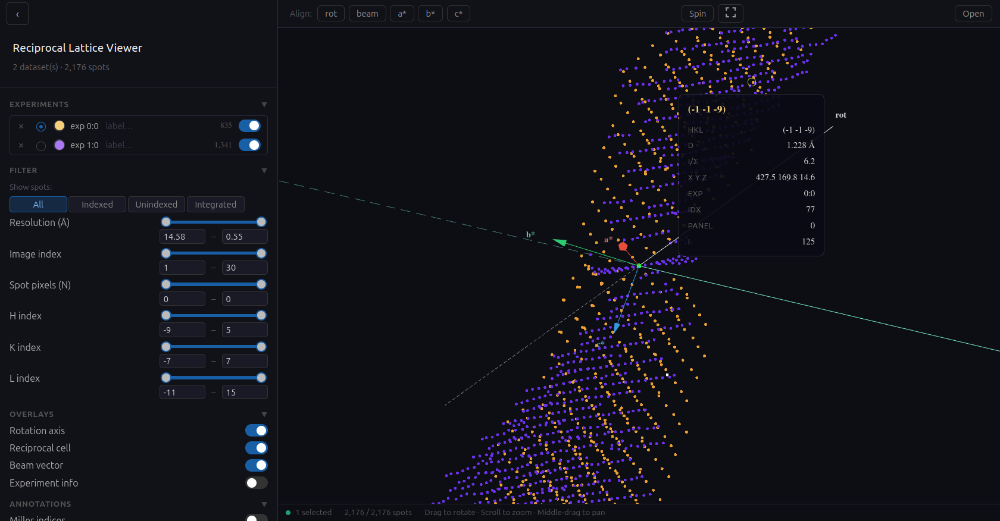

# RLV — Reciprocal Lattice Viewer

A web replacement for the DIALS reciprocal lattice viewer.

**[Open the viewer](https://mpks.github.io/rlv/)** · [Theory](https://github.com/mpks/rlv/wiki)

## Desktop app (Linux)

Download the latest version:

- [AppImage](../../releases/latest/download/RLV-linux-x86_64.AppImage) — any Linux distribution.
  Make it executable and run it: `chmod +x RLV-linux-x86_64.AppImage && ./RLV-linux-x86_64.AppImage`
- [deb package](../../releases/latest/download/RLV-linux-amd64.deb) — Debian/Ubuntu: `sudo apt install ./RLV-linux-amd64.deb`
- [rpm package](../../releases/latest/download/RLV-linux-x86_64.rpm) — Fedora/RHEL: `sudo dnf install ./RLV-linux-x86_64.rpm`

Older versions are on the [Releases](../../releases) page.

## Licence

BSD 3-Clause, © Science and Technology Facilities Council. See [LICENSE](LICENSE).
